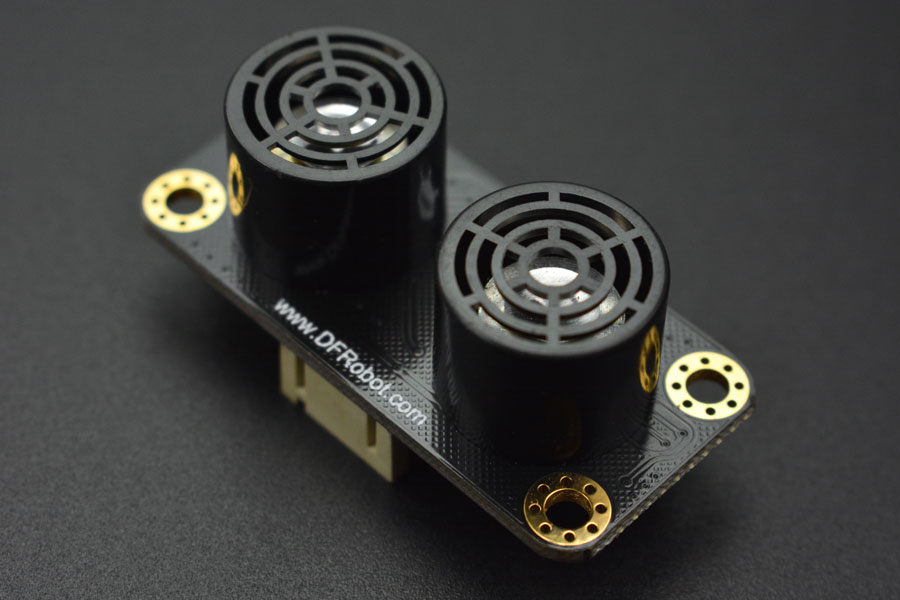

# DFRobot_URM09
- [中文版](./README_CN.md)

This is an ultrasonic distance sensor module with open dual probe. It adopts I2C communication and standard interface of Gravity PH2.0-4P vertical patch socket. The module is compatible with controllers with 3.3V or 5V logical level, such as Arduino and Raspberry Pi. The ultrasonic sensor comes with built-in temperature compensation, providing effective ranging within 2cm to 500cm. It offers resolution of 1cm and accuracy of ±1%. There are three measurement ranges designed for programs to select: 150cm, 300cm, 500cm. Please note that setting shorter range will cause shorter ranging cycle and lower sensitivity. You may need to set it according to the actual use.

This module can be widely applied to outdoor environment, not least with rapid changes of temperature difference. It is definitely a prime select when it comes to projects like robot auto collision avoidance walk, car reversing alarm, doorbell, guard alert, subway safety line prompt, and one meter line prompt in bank and front of ATM machine. <br>
This ranging module, with small size, provides strong environment applicability, high accuracy and wide measurement range, plug and play, easy to use.




## Product Link(https://www.dfrobot.com/product-1832.html)

    SKU：SEN0304

## Table of Contents

* [Summary](#Summary)
* [Installation](#Installation)
* [Methods](#Methods)
* [Compatibility](#Compatibility)
* [History](#History)
* [Credits](#Credits)

## Summary

Effective ranging within 2cm to 500cm, resolution of 1cm and accuracy of ±1%

There are three measurement ranges: 150cm, 300cm, 500cm. Two measurement modes: active or passive(select by program).

Revisable I2C device address, avoiding multiple devices address conflicts.

## Installation
Download the library file before use, paste it into the custom directory for Raspberry Pi, then open the examples folder and run the demo in the folder.

## Methods

```python
  def set_mode_range(self ,range ,mode):
    '''!
      @brief    Set dc motor encoder reduction ratio
      @param range: Measured distance
      @n            _MEASURE_RANG_500             #Ranging from 500
      @n            _MEASURE_RANG_300             #Ranging from 300
      @n            _MEASURE_RANG_150             #Ranging from 150
      @param mode: Set mode
      @n            _MEASURE_MODE_AUTOMATIC       #automatic mode
      @n            _MEASURE_MODE_PASSIVE         #passive mode
    '''

  def measurement_start(self):
    '''!
      @brief    Passive mode ranging command
    '''

  def get_temperature(self):
    '''!
      @brief    get Temperature
      @return   Temperature
    '''

  def get_distance(self):
    '''!
      @brief    get distance
      @return   Distance
    '''

  def modify_device_number(self ,Address):
    '''!
      @brief    Modify i2c device number
      @param Address: i2c device number 1-127
    '''

  def get_device_number(self):
    '''!
      @brief    read i2c device number
      @return   i2c device number
    '''
```

## Compatibility

* RaspberryPi Version

| Board        | Work Well | Work Wrong | Untested | Remarks |
| ------------ | :-------: | :--------: | :------: | ------- |
| RaspberryPi2 |           |            |    √     |         |
| RaspberryPi3 |     √     |            |          |         |
| RaspberryPi4 |           |            |    √     |         |

* Python Version

| Python  | Work Well | Work Wrong | Untested | Remarks |
| ------- | :-------: | :--------: | :------: | ------- |
| Python2 |     √     |            |          |         |
| Python3 |     √     |            |          |         |


## History

- 2019/06/25 - V1.0.0 Version
- 2020/05/30 - V1.1.0 Version
- 2022/01/10 - V1.2.0 Version


## Credits

Written by ZhixinLiu(zhixin.liu@dfrobot.com), 2021. (Welcome to our [website](https://www.dfrobot.com/))
