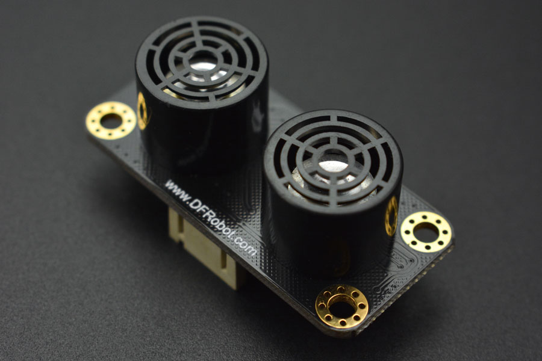

# DFRobot_URM09
- [English Version](./README.md)

这是一款开放式双探头超声波测距模块，通信方式为I2C,采用Gravity标准PH2.0-4P立式贴片座接口。该模块兼容arduino、树莓派等各种3.3V或5V逻辑电平的主控板。模块自带温度补偿，平整墙面的有效测距量程为2–500cm，分辨率为1cm，误差约为±1%。 设计150cm、300cm、500cm 三个测距量程可供程序选择切换，更短的量程设置会带来更短的测距周期和更低的测距灵敏度，用户可根据实际使用需求灵活设置。

可以广泛应用于户外环境中，尤其适用于温差变化较快的环境。是机器人自动避障行走，汽车倒车报警器、门铃、警戒报警器、地铁安全线提示、银行及取款机的一米线提示等等项目的绝佳选择。<br>
本款测距模块体积小，环境适用性强，精度高，测量范围广，即插即用，方便快捷。




## 产品链接（https://www.dfrobot.com.cn/goods-1905.html）

    SKU：SEN0304

## 目录

* [概述](#概述)
* [库安装](#库安装)
* [方法](#方法)
* [兼容性](#兼容性y)
* [历史](#历史)
* [创作者](#创作者)

## 概述

有效测距量程为2–500cm，分辨率为1cm，误差约为±1%。

150cm、300cm、500cm 三个测距量程，主动测量和被动测量可供程序选择切换。

可以修改I2C设备地址，防止多个设备的冲突。

## 库安装
使用此库前，请首先下载库文件，将其粘贴到树莓派的自定义目录中，然后打开examples文件夹并在该文件夹中运行演示。

## 方法

```python
  def set_mode_range(self ,range ,mode):
    '''!
      @brief    Set dc motor encoder reduction ratio
      @param range: Measured distance
      @n            _MEASURE_RANG_500             #Ranging from 500
      @n            _MEASURE_RANG_300             #Ranging from 300
      @n            _MEASURE_RANG_150             #Ranging from 150
      @param mode: Set mode
      @n            _MEASURE_MODE_AUTOMATIC       #automatic mode
      @n            _MEASURE_MODE_PASSIVE         #passive mode
    '''

  def measurement_start(self):
    '''!
      @brief    Passive mode ranging command
    '''

  def get_temperature(self):
    '''!
      @brief    get Temperature
      @return   Temperature
    '''

  def get_distance(self):
    '''!
      @brief    get distance
      @return   Distance
    '''

  def modify_device_number(self ,Address):
    '''!
      @brief    Modify i2c device number
      @param Address: i2c device number 1-127
    '''

  def get_device_number(self):
    '''!
      @brief    read i2c device number
      @return   i2c device number
    '''
```

## 兼容性

* RaspberryPi Version

| Board        | 正常运行  | 运行失败   | 未测试    | 备注
| ------------ | :-------: | :--------: | :------: | :-----: |
| RaspberryPi2 |           |            |    √     |         |
| RaspberryPi3 |           |            |    √     |         |
| RaspberryPi4 |     √     |            |          |         |

* Python版本

| Python  | 正常运行  | 运行失败   | 未测试    | 备注
| ------- | :-------: | :--------: | :------: | :-----: |
| Python2 |     √     |            |          |         |
| Python3 |     √     |            |          |         |


## 历史

- 2019/06/25 - V1.0.0 版本
- 2020/05/30 - V1.1.0 版本
- 2022/01/10 - V1.2.0 版本


## 创作者

Written by ZhixinLiu(zhixin.liu@dfrobot.com), 2021. (Welcome to our [website](https://www.dfrobot.com/))